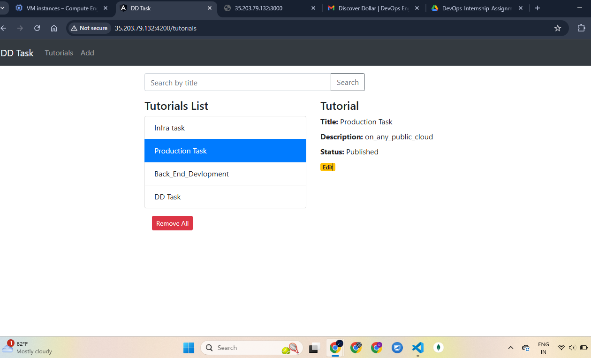
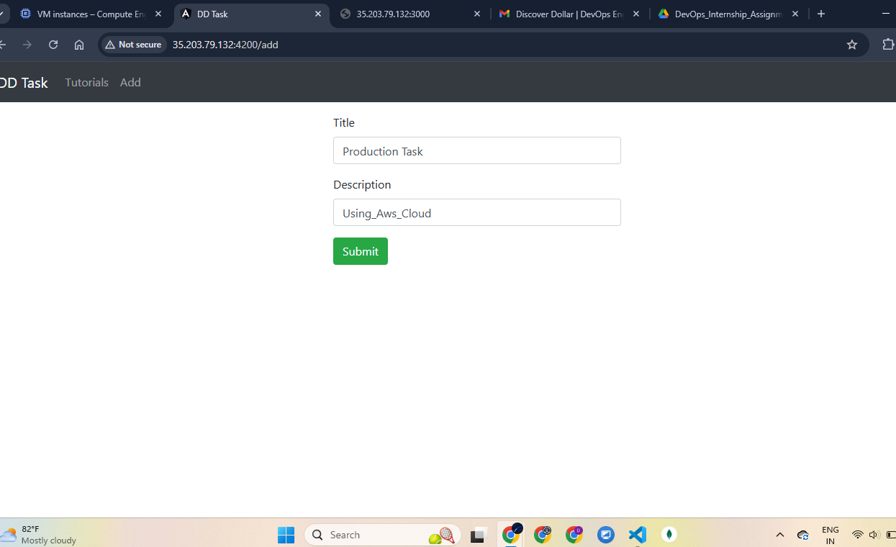
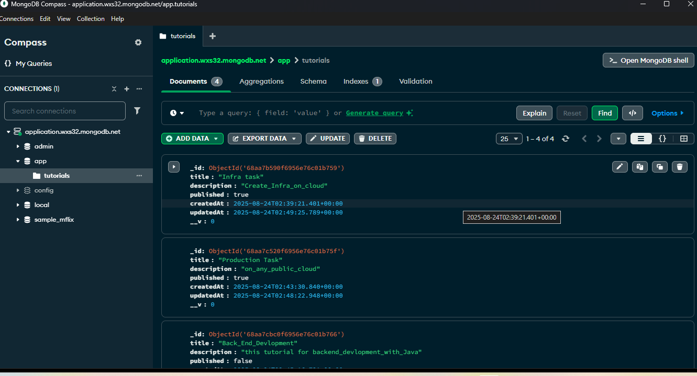

🚀 MEAN Stack Application Deployment Assignment

Containerization | Cloud Deployment | CI/CD Automation

📑 Table of Contents

Repository Setup

Deployment on Ubuntu VM

Database Setup

CI/CD Pipeline

Nginx Reverse Proxy

Conclusion

🗂 Repository Setup ✅

Created GitHub repository: crud-dd-task-mean-app

Pushed complete MEAN stack application code to the repository.

☁ Deployment on Ubuntu VM ✅

Provisioned an Ubuntu VM on cloud (GCP/Azure).

Installed Docker and Docker Compose.

Deployed the application stack using docker-compose up -d.

🗄 Database Setup ✅

Configured MongoDB service with persistent storage using Docker volumes.

Ensures database data is retained across container restarts.

🔄 CI/CD Pipeline ✅

Configured GitHub Actions workflow to:

Build Docker images for backend and frontend.

Push images to Docker Hub.

Pull updated images and restart services automatically on VM.

🌐 Nginx Reverse Proxy ✅

Configured Nginx to manage routing:

Angular frontend served at root path /.

Backend API accessible via /api/.

🏁 Conclusion

The MEAN stack application was successfully:

Containerized with Docker

Deployed on a cloud-based Ubuntu VM

Connected with MongoDB database (persistent volume)

Automated with a GitHub Actions CI/CD pipeline

Served via Nginx reverse proxy

✅ The deployment pipeline is automated, scalable, and production-ready.

## 📫 How to Reach Me...
- **LinkedIn**: [Clik Here](https://www.linkedin.com/in/devops-engineer1/)
- **Whatsapp**: [Click Here](https://wa.me/918931004042)
- **HackerRank**: [Click Here](https://www.hackerrank.com/profile/thecomputersk)

---

## 📸 Screenshots

